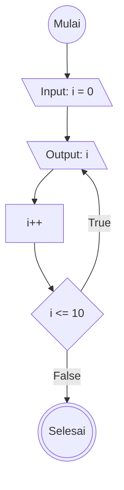

# do-while Loop

## Definisi do-while Loop
do-while loop sama seperti while loop yaitu struktur kontrol program untuk mengulang blok kode berkali kali selama kondisi bernilai True tapi akan menjalankan blok kode sekali sebelum masuk ke iterasi dan penulisan nya diatas while

do-while loop ditulis dengan dengan ekspresi didalam parameternya

Satu kali ter eksekusi disebut dengan satu iterasi

example code : 
let i = 0
do{
    console.log(i)
    i++
}
while(i <= 10)

## Flowchart do-while Loop

