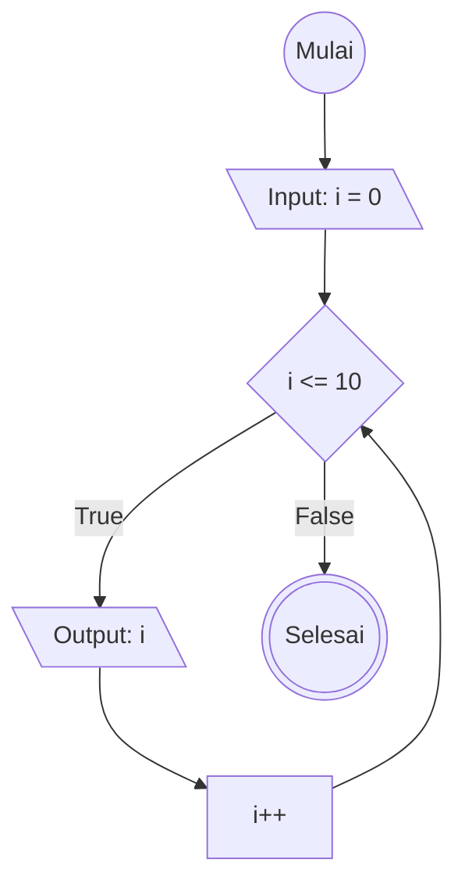

# For Loop

## Definisi For Loop
For loop adalah struktur kontrol program untuk mengulang blok kode berkali kali hingga kondisi pengecekan terpenuhi

For loop terdiri dari inisialisasi; kondisi;increment/decrement

Satu kali ter eksekusi disebut dengan satu iterasi

example code : 
for(let i = 0; i < 10; i++){
    console.log(i)
}

## Flowchart For Loop

