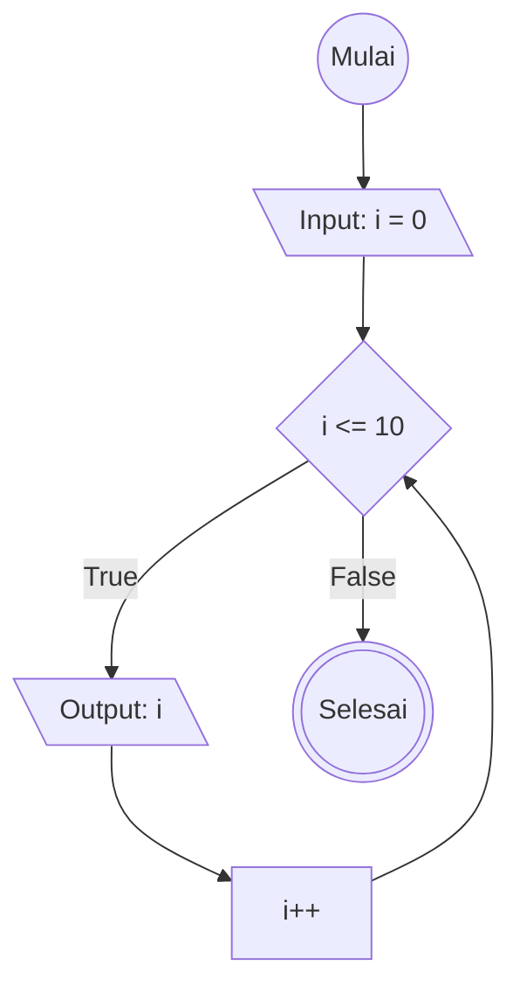

# while Loop

## Definisi while Loop
while loop mirip seperti for yaitu struktur kontrol program untuk mengulang blok kode berkali kali tapi selama kondisi bernilai True

while loop ditulis dengan dengan ekspresi didalam parameternya

Satu kali ter eksekusi disebut dengan satu iterasi

example code : 
let i = 0
while(i <= 10){
    console.log(i)
    i++
}

## Flowchart while Loop

